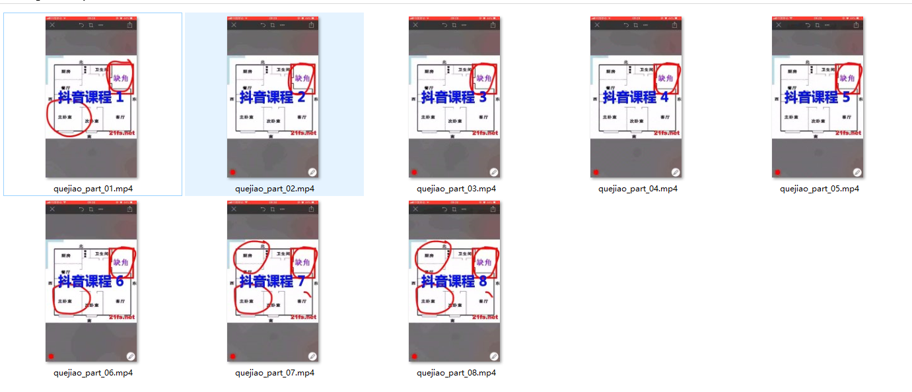

# dy_split_vedio

python脚本 最近抖音比较火，可是新用户只能发15秒的视频，这个脚本可以把一个视频按15秒进行分开，并且加上标题，在ubuntu上测试成功

## 分割后的效果图

## 使用方法
>usage: split_vedio.py [-h] filename title titlecolor
>
>split vedio many and drawtext
>
>positional arguments:
>
>  - filename    mp4 filename
>  - title       drawtext title text
>  - titlecolor  title text color

- python split_vedio.py -h
- python split_vedio.py 视频路径 标题名字 颜色
- python split_vedio.py dy.mp4 抖音课程 red

## python 版本

Python 2.7.3

## 依赖
- FreeType：https://downloads.sourceforge.net/freetype/freetype-2.9.1.tar.bz2
- fribidi：https://github.com/fribidi/fribidi/releases/download/v1.0.3/fribidi-1.0.3.tar.bz2

##  ffmpeg
- 编译ffmpeg 时候，记得加入 --enable-libfreetype 要不然drawtext会出错
- ./configure --enable-libfreetype

## 需要安装
- apt-get install ffmpeg
- pip install ffmpeg-python

